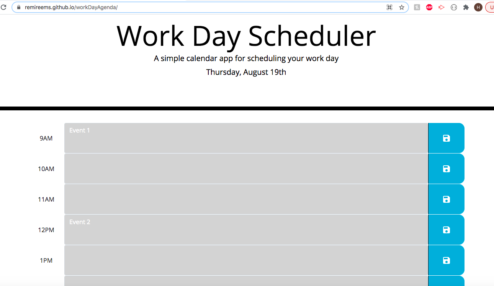

# workDayAgenda

For this assignment, I have added in the js code (not jQuery, my instructor said it was okay not to do it) to make the schedule function with the current date and time. When the user adds in their events, they can click the save icon to save the events. When they refresh the page, the saved events will not disappear as they were stored in a local storage. When the user deletes the event and saves it, it will erase what was typed in the textarea. When the schedule hour time matches with the current hour time, the timeblock will be highlighted red. When the schedule htr time is ahead of current hr time, those timeblocks will be highlighted green. When the schedule hr time is before the current hr time, those timeblocks will be highlighted grey. I have added in some html to create and display the schedule on the webpage. Also, I have added in some css to make the schedule look organized and centered.  

URL: https://remireems.github.io/workDayAgenda/

Screenshot:

